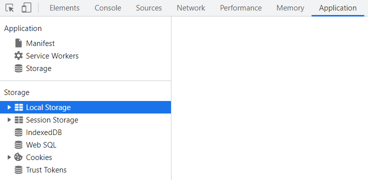

我們可以在 `Developer Tools` 的 `Application` 面板下看到瀏覽器的本地存儲包含了：`Cookie`、`Session Storage` 和 `Local Storage`。



## **Cookie 是什麼**

`Cookie` 是伺服器傳送給瀏覽器的一小段資料，瀏覽器可以將其保存並在下一次請求時將 `Cookie` 傳給相同的伺服器。`Cookie` 最常見的用途之一是認證身份，例如登入狀態、購物車等，也被應用於追蹤使用者及廣告上。

### Cookie 是如何工作的

`Cookie` 通常是由伺服器生成的，然後通過 `Response Header` 的 `Set-Cookie` 發送給客戶端瀏覽器。

``` text
HTTP/1.0 200 OK
Content-type: text/html
Set-Cookie: my_cookie=bulandent
```

當瀏覽器接收到 `Set-Cookie header`，便會將 `Cookie` 保存起來，並且在下一次請求時將 `Cookie` 附在 `Request Header` 發送給伺服器，這樣伺服器就可以讀取 `Cookie` 中的資料。

``` text
GET /home.html HTTP/1.1
Host: www.example.org
Cookie: my_cookie=bulandent
```

<!--truncate-->

### Cookie 分類

按照 `Cookie` 的生命週期可以將它分爲兩類：

- `Session Cookie`：沒有指定過期時間 （`Expires`）或有效期（`Max-Age`）的 `Cookie`，`Session Cookie` 會被保存在瀏覽器的內存中，因此當瀏覽器關閉後會被自動刪除。
- `Persistent cookie`：通過指定過期時間 （`Expires`）或有效期（`Max-Age`）的一種 `Cookie`，`Persistent cookie`被保存在客戶端的硬碟中。

### Cookie 限制

`Cookie` 會綁定特定的域名（`Domain`），除此之外，它還有如下一些限制：

通常，只要遵守以下大致的限制，就不會在任何瀏覽器中碰到問題：

- 不超過 300 個 `Cookie`。
- 每個 `Cookie` 不超過 4KB。
- 每個域名下不超過 20 個 `Cookie`。

每個域能設置的 `Cookie` 總數也是有數量上限的，但不同瀏覽器的限制也會有些不同。例如：

- Safari 和 Chrome 對每個域的 `Cookie` 數沒有硬性限制。
- 最新版 IE 和 Edge 限制每個域不超過 50 個 `Cookie`。
- 最新版 Firefox 限制每個域不超過 150 個 `Cookie`。

如果 `Cookie` 總數超過了單域名的上限，瀏覽器就會刪除之前設置的 `Cookie`，而刪除的邏輯不同瀏覽器也會不同。

### Cookie 構成

> [伺服器 Demo 代碼](https://github.com/shineve/Study-Notes/tree/main/book-club/cookie-and-browser-storage)

`Cookie` 構成除了以上提到的 `Name`、`Value`、`Domain`、`Expires/Max-Age` 外，還有幾個比較重要的需要說下：

- `Path`：請求 `URL` 中包含這個路徑，瀏覽器才會把 `Cookie` 夾帶到 `Request Header` 並發送到伺服器。
- `Secure`：只有 `HTTPS` 請求才會夾帶標記爲 `Secure` 的 `Cookie`，如果是 `HTTP` 則不夾帶（localhost除外）。
- `HttpOnly`：當 `Cookie` 被設定為 `HttpOnly`，客戶端無法透過 `document.cookie` 讀取該 `Cookie`。
- `SameSite`：控制 `Cookie` 在跨站請求的時候是否會被發送，有 3 個值：
  - `None` 允許跨站請求發送。
  - `Lax`：允許跨站 `GET` 請求發送。
  - `Strict`：不允許跨站請求發送。

> 除了伺服器能夠設置 `Cookie` 外，客戶端也可以通過 `document.cookie` 設置。

### Cookie 缺陷

- `Cookie` 會被附加在每個 `HTTP` 請求中，所以無形中增加了流量。
- 由於在 `HTTP` 請求中的 `Cookie` 是明文傳遞的，所以安全性成問題，除非使用 `HTTPS`。
- `Cookie` 的大小限制在 `4KB` 左右，對於複雜的存儲需求來說是不夠用的。

### Cookie 安全

黑客常常會利用 `Cookie` 進行攻擊，比如 `XSS` 和 `CSRF` 等，所以爲了網站安全，通常需要針對 `Cookie` 做一些安全措施：

- 對特殊的 `Cookie` 設置 `HttpOnly`，防止被客戶端腳本讀取，比如維持登入狀態的 `Cookie`。
- 用於敏感信息（例如指示身份驗證）的 `Cookie` 的 `Expires/Max-Age` 應設置較短，並且 `SameSite` 屬性設置爲`Strict` 或 `Lax`。

## **Web Storage**

`Web Storage` 存在的目的就是爲了解決每次向伺服器請求的時候都需要攜帶 `Cookie` 信息的問題。`Web Storage` 包含了 2 個對象：`Session Storage` 和 `Local Storage`。通過這 2 個對象實現了：

- 可以保存大於 `4KB` 的資料。
- 提供 `Cookie` 以外方式保存會話資料。
- 提供 `Cookie` 以外方式保存持久化資料。

### Web Storage 的限制

和其他客戶端存儲方案一樣，`Web Storage` 也有限制。

- 存儲大小：不同瀏覽器給 `Session Storage` 和 `Local Storage` 設置了不同的空間限制，但大多數會限制爲每個 `origin` 可以保存 `5MB`。
- 存儲類型：只能存儲字符串，所以如果資料是對象結構的，需要通過 `JSON.stringify` 先轉成字符串。
- 存儲限制於同一個 `origin`，這也是 [Same-origin policy](https://developer.mozilla.org/zh-TW/docs/Web/Security/Same-origin_policy) 的限制之一。即 `http://a.com` 和 `https://a.com` 存儲的 Web Storage` 資料是不相同的。

`Web Storage` 提供了一套詳細的 `API` 使得我們可以很好的進行資料存儲：

### Web Storage API

- `Storage.getItem()`：該方法接受一個`key`作爲參數，返回`key`對應的值。
- `Storage.setItem()`：該方法接受一個`key`和值作爲參數，將會把鍵值對添加到存儲中，如果`key`存在，則更新其對應的值。
- `Storage.removeItem()`：該方法接受一個`key`作爲參數，並把該`key`從存儲中刪除。
- `Storage.clear()`：調用該方法會清空存儲中的所有`key`。

`Session Storage` 和 `Local Storage` 都是 `Storage` 的實例，所以自然而然的它們都擁有上面的屬性和方法。

### Session Storage

`Session Storage` 對象只會存儲會話資料，這意味着當瀏覽器 tab 頁被關閉的時候，對應的 `Session Storage` 資料將被清除。除此之外，它還有如下表現：

- 不受頁面刷新（包括強制刷新）影響，並且可以在瀏覽器崩潰並重啓後恢復。
- 在當前頁面通過新 tab 或 window 打開一個新頁面的時候，新頁面會複製父級頁面的 `Session Storage` 資料。
- 使用同一個 `URL` 打開多個 tab，它們各自的 `Session Storage` 資料不同。

### Local Storage

與 `Session Storage` 不同，`Local Storage` 資料不會因為 `session` 退出而消失，它會一直保留在瀏覽器中，直到手動刪除或清除瀏覽器緩存。

## 參考文件

1. [GitHub 伺服器 Demo](https://github.com/shineve/Study-Notes/tree/main/book-club/cookie-and-browser-storage)
