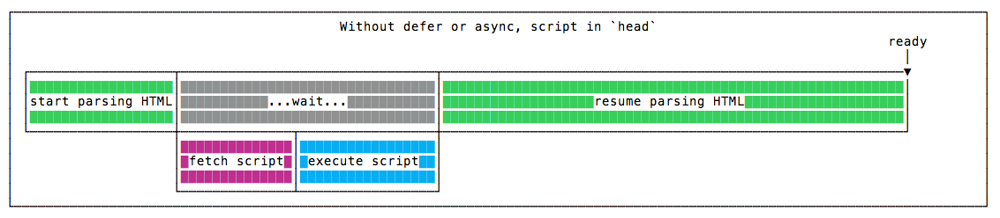

通過標籤 `async` 和 `defer`，我們可以調整網頁所引入的 JavaScript 文件的執行順序。

## 將 `<script>` 加在 `<head>`

瀏覽器一旦解析到 `<script>` 就會

1. 停止解析
2. 對 `script` 發起請求
3. 下載 `script`
4. 執行 `script`
5. 完成後繼續向下解析

在以上的過程中，每個過程之間會有網路延遲，過程中會導致整個瀏覽器解析卡住，無法繼續渲染。

<!--truncate-->

## 將 `<script>` 加在 `<body>` 的最後

瀏覽器解析過程與上面相同，但因為 `<script>` 被放在最後，所以頁面的內容會先完全呈現在瀏覽器中，用戶也會因為空白畫面的時間縮短而感到速度變快了。

## script defer

瀏覽器一旦解析到 `defer` 的 `<script>` 時就會

1. 對 `script` 發起請求
2. 下載 `script`
3. 在瀏覽器解析完 `HTML` 之後才執行 `script`
4. `defer` 會從上到下按照順序執行 `script`

使用 `defer` 的效果與放在 `<body>` 最後類似，但請求會更早的被發出，所以整體的加載時間會縮短。

## script async

瀏覽器一旦解析到 `async` 的 `<script>` 就會

1. 對 `script` 發起請求
2. 下載 `script`
3. 下載完成後停止解析 `HTML`
4. 執行 `script`
5. 完成後繼續向下解析 `HTML`

解析過程與將 `<script>` 加在 `<head>` 的效果類似，但 `script` 會在下載完成後才執行，所以整體的加載時間會縮短。

## 執行順序

`defer` 會根據在 `HTML` 中的先後順序來依次執行。

`async` 在下載完之後就會執行。

## 何時使用

`defer` 會在 DOM 載完後才執行，因此大部分場景都可以使用。

`async` 會在下載完之後就執行，因此無法掌握它的執行時間點，因此只能用在完全可以單獨使用的 `script` ，同時也是不會操作 DOM 的 `script` 。例：Google Analytics
