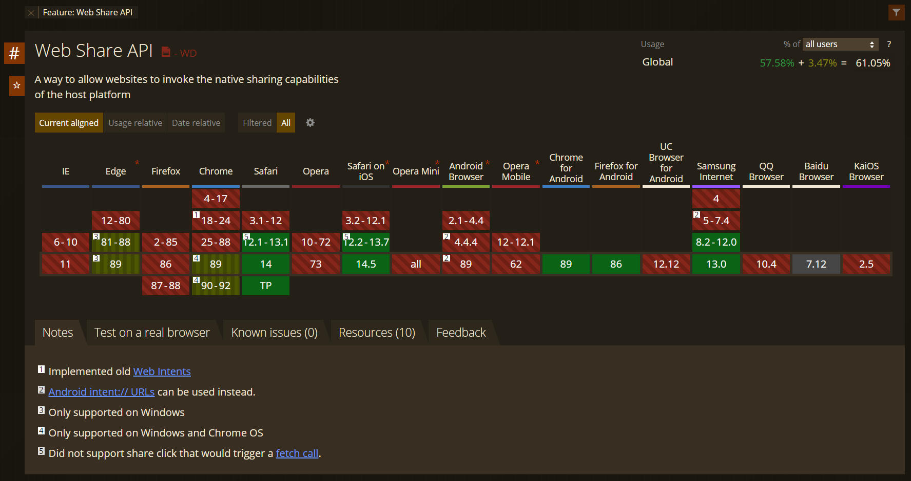

In this tutorial, you would learn how to use the Web share API in your website or web app.

Sharing is easy in native apps but it was always a pain for web, but now [Web Share API](https://w3c.github.io/web-share/) brings native content sharing to the web. Now you can offer native way to sharer links, text and other content from a web page to desired target.

[Demo](https://codepen.io/shineve/pen/bGgeWbZ)

## The requirements

There are requirements before the API is available and can be used:

1. HTTPS
2. Can only be invoked by user action, such as a button click
3. Only `title`, `text`,  `url` and `files` are supported

<!--truncate-->

## Browser compatibility

The Web Share API now only works in some browsers, you should check if user's browser support is eligible to use the API, if it doesn't, then you should add a fallback option for those browsers.

You can check the supported browsers [**here**](https://caniuse.com/web-share).



Use the code below to check if browser supports the Web Share APIs.

```jsx
if (navigator.share) {
  // Web Share API is supported
  console.log('Thanks for sharing');
} else {
  // Fallback
  console.error('Web Share API not supported in your browser.');
}
```

## Examples

### Sharing Examples

```jsx
async function share() {
  if (navigator.share) {
    try {
      await navigator.share({
        url: 'https://shineve.hashnode.dev/',
        title: "Shineve's ",
        text: "Shineve's hashnode blog",
      });
      console.log('Thanks for sharing');
    } catch (err) {
      // User rejected sharing or something goes wrong
      const { name, message } = err;
      if (name === 'AbortError') {
        // User rejected sharing
        console.log('Share is cancelled.');
      } else {
        // Something goes wrong
        console.error('Error: ', err);
      }
    }
  } else {
    // Fallback
    console.error('Web Share API not supported in your browser.');
  }
}
```

### File Sharing Examples

```jsx
async function shareFiles() {
  if (navigator.canShare && navigator.canShare({ files: filesArray })) {
    try {
      await navigator.share({
        files: filesArray,
        title: 'Pictures',
        text: 'My Pictures.',
      });
      console.log('Thanks for sharing');
    } catch (err) {
      const { name, message } = err;
      if (name === 'AbortError') {
        // User rejected sharing
        console.log('Share is cancelled.');
      } else {
        // Something goes wrong
        console.error('Error: ', err);
      }
    }
  } else {
    // Fallback
    console.error('Web Share API not supported in your browser.');
  }
}
```

## Wrapping up

This article covers pretty much the baseline for what you need to know about the Web Share API. Although browser support is spotty, a fallback can be easily implemented, so more websites should adopt this to let your user share your content more easily across a wider variety of social networks, with contacts and other native apps.

If you want to learn more about this API, you can read the [specification here](https://w3c.github.io/web-share/).

## Resources

* [Can I Use - Web Share API](https://caniuse.com/web-share)
* [MDN - Navigator.share()](https://developer.mozilla.org/en-US/docs/Web/API/Navigator/share)
* [W3C - Web Share API](https://w3c.github.io/web-share/)
