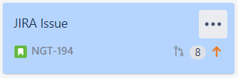
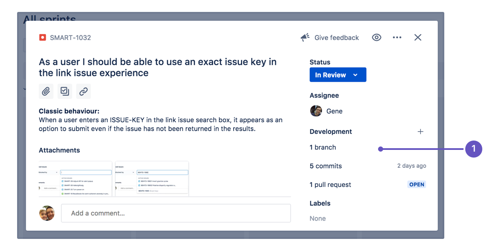

Automation had been setup in **DEV** project, if you pass in a valid ticket ID, the referenced issue will transit automatically depending on your action to save you a little time to adjust the issue status yourself.

**Check out [GitHub actions](https://github.com/features/actions) if you are interested how the automation works.**

### What is a ticket ID?

You can find the ticket ID from the bottom left corner of your issue card.

**ticket ID example:**



**NGT-194 is the ticket ID.**

## How to name your branch

```text
  <ticket-id>/<branch-type>_<branch-name> (**DEV-112/feature_user-login**)
```

<!--truncate-->

## Supported Actions

1. **Create Branches**
   Branch name example: **DEV-112/feature_user-login**
   Issue will automatically transit from `To Do` to `In Progress` .

2. **Create Commits**
   Commit name example: "DEV-112 Initial commit"
   Issue will automatically transit from `To Do` to `In Progress` .

3. **Create Pull Requests**
   Pull Requests name example: "[DEV-112] Feature Login User"
   Multiple Issues example: "[DEV-111 DEV-112 DEV-113] Feature User Management"
   All Issues will automatically transit from `In Progress` to `Code Review` .

4. **Pull Requests Approved**
   Issue will automatically transit from `Code Review` to `Deploy` .

5. **Pull Requests Declined**
   Issue will automatically transit from `Code Review` to `In Progress` .

## View the development panel

If everything has been set up correctly, you will see a development panel on each of your issues, similar to the screenshot below. The development panel provides you with just enough information to evaluate the status of an issue's development at a glance.



## References

[How To Reference issues in Jira](https://support.atlassian.com/jira-software-cloud/docs/reference-issues-in-your-development-work/)

[Process issues with smart commits](https://support.atlassian.com/jira-software-cloud/docs/process-issues-with-smart-commits/)
