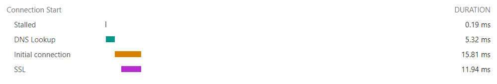
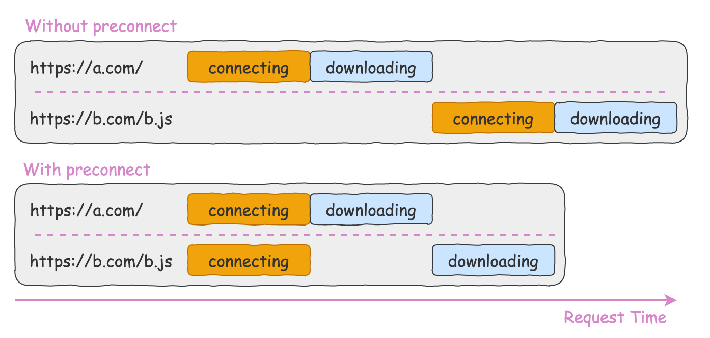

當瀏覽器需要對別的 domain 下的資源請進行求的時候，瀏覽器必須與該伺服器建立連線。

建立一個安全的連線包含以下三個步驟

1. DNS Lookup
2. TCP Handshake
3. (HTTPS connection) SSL Negotiation



上面的 3 個步驟中，每一步都會需要一個 RTT (Round Trip Time) 的來回時間。所以在實際傳輸資料之前，已經花了 3 個 RTT 的時間。如果在網路狀況很差的狀況下，會讓獲取資源的速度大大降低。

我們可以透過 `<link rel=preconnect>` 和 `<link rel=dns-prefetch>` 來提前處理好以上的連線，就可以讓網頁整體的載入速度更迅速。

<!--truncate-->

## **`rel=preconnect`**

---

如果我們知道網站需要對哪個 domain 的資源進行請求時，我們就可以利用 `rel=preconnect` 提早建立好與特定 domain 之間的連線。這讓我在請求的當下省去了一次完整的 (DNS Lookup + TCP Handshake + SSL Negotiation) ，共三個 RTT 的時間。

假設當前網站是   `https://a.com` ，這個網站的首頁需要請求   `https://b.com/b.js`   這個資源。對比正常請求和配置了   `rel=preconnect` 時候的請求，它們在 waterfall 上看到的表現是不一樣的：



通過如下配置可以提前建立和   `https://b.com`   這個域的連線：

```jsx
<link rel="preconnect" href="https://b.com">
```

通過   `preconnect`   提早建立和第三方源的連線，可以將資源的載入時間縮短 100ms ~ 500ms，這個時間雖然看起來微不足道，但是它是實實在在的優化了頁面的效能，提升了使用者的體驗。

## `preconnect` 應用場景

通常只會對確定短時間內就會用到的 domain 做 `preconnect` ，因為如果 10 秒內沒有使用的話，瀏覽器會自動把連線 close 掉。

### 例子一：CDN

如果網站會從某個 CDN 請求很多資源（例如 image CDN），但又不確定會載入哪些資源時，可以對 CDN 做 `preconnect` 。


### 例子二：Streaming 串流媒體

例如我們希望用戶手動去點擊開始才載入媒體資源而不是進入頁面就做載入，我們可以在使用者鼠標移到元件範圍時，對媒體資源 domain 做 `preconnect` ，這樣當使用者真的點下播放鍵時可以更快速的播放影片。

## **`rel=dns-prefetch`**

---

跟 `preconnect` 類似，差別在於 `dns-prefetch` 只預先處理第一步 DNS Lookup 而已。也就是說

dns-preconnect = DNS Lookup
preconnect = DNS look up + TCP Handshake + SSL Negotiation

另外由於 `preconnect` 的瀏覽器相容稍微比 `dns-prefetch` 低，因此 `dns-prefetch` 可以作為不支援預連線的瀏覽器的後備選擇，同時配置它們兩即可：

```jsx
<link rel="preconnect" href="https://cdn.bootcss.com">
<link rel="dns-prefetch" href="https://cdn.bootcss.com">
```

## ** `dns-prefetch` vs `preconnect` **

---

既然能通過   `preconnect`   來減少整個建立連線的時間，那為什麼還需要   `dns-prefetch`   來減少建立連線中第一步 DNS 查詢解析的時間呢？

`preconnect` 所耗費的資源是比較多的，因此當我們確定短時間內就會向某個 domain 發送請求的話，就可以使用 `preconnect` 。

如果某一些請求是偶爾才會發生的話，則使用 `dns-prefetch` 即可。這樣可以避免無用的 TCP Handshake 及 SSL Negotiation 發生。
