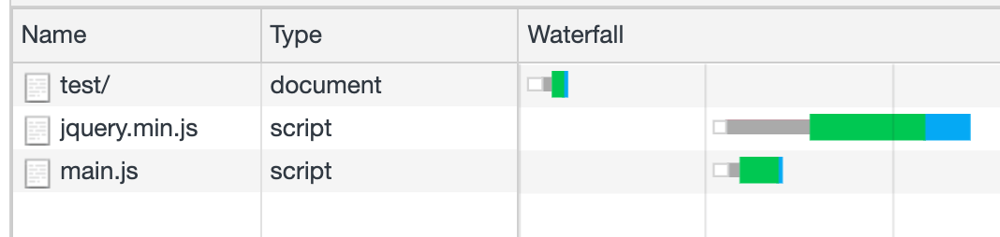
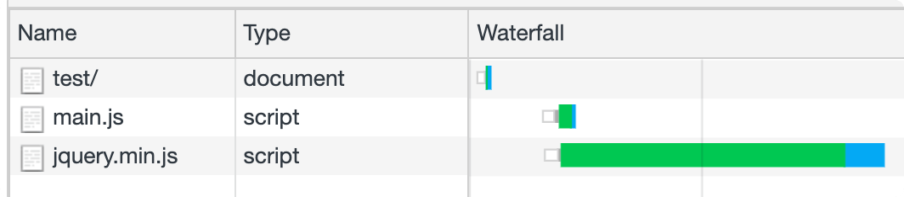
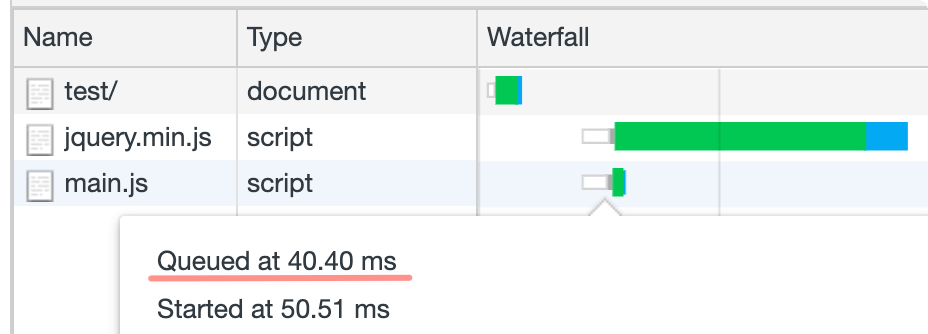
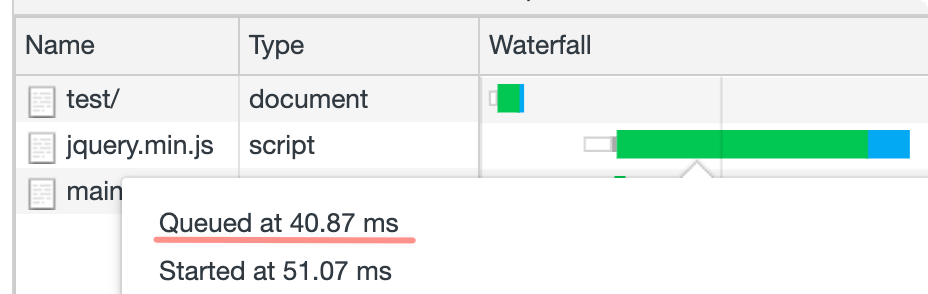
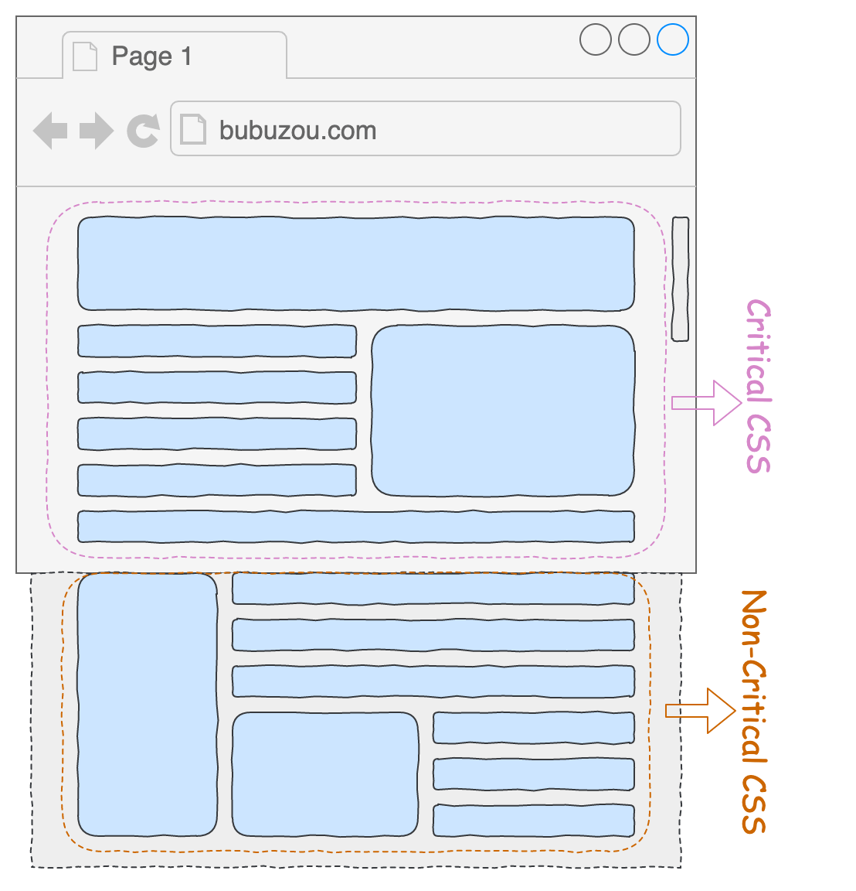
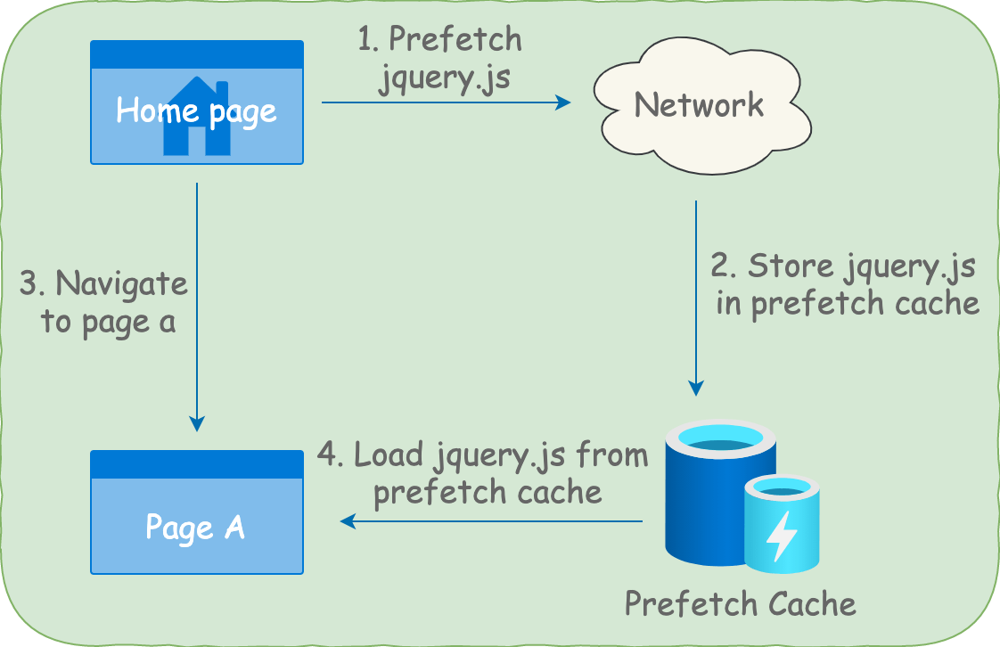
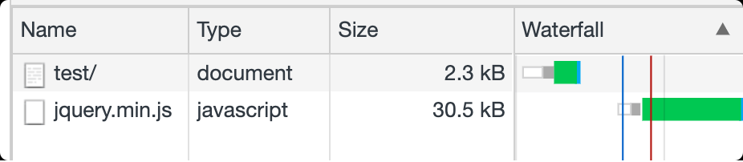
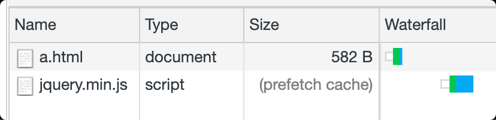

## **`preload`**

每一個類型的資源在瀏覽器中都有默認的載入優先順序，而 preload 就是能夠提升資源載入的優先順序，使得它的載入會提早開始（預載入），在需要用的時候能夠更快的使用上。

| Resource Type                   | Priority                                                                                                                                          |
| ------------------------------- | ------------------------------------------------------------------------------------------------------------------------------------------------- |
| HTML                            | Highest                                                                                                                                           |
| Fonts                           | High                                                                                                                                              |
| Stylesheets                     | Highest                                                                                                                                           |
| Stylesheets loaded with @import | Highest, will be queued after blocking scripts.                                                                                                   |
| Images                          | Default priority Low, upgraded to Medium when rendered in the initial viewport.                                                                   |
| JavaScript                      | Low, Medium or High. See Addy Osmani’s [JavaScript Loading Priorities in Chrome](https://addyosmani.com/blog/script-priorities) for more details. |
| Ajax, XHR, or fetch() API       | High                                                                                                                                              |

<!--truncate-->

當某個頁面載入了 2 個指令碼   `jquery.min.js`   和   `test.js` ：

```jsx
<script src="https://cdn.jsdelivr.net/npm/faker@5.5.3/index.min.js"></script>
<script src="./test.js"></script>
```

此時該頁面的資源載入 Waterfall 長這樣：




當在 `<head>` 裡通過 `<link>` 標籤給 test.js 配置 `preload` 預載入後：

```jsx
<link rel="preload" as="script" href="./test.js">
```

此時的 `test.js` 載入順序出現在了 `jquery.min.js` 的前面，這就是 `preload` 提升資源載入優先順序的效果。



可以看到 `test.js` 的 queued time 是比 `jquery.min.js` 來的早的





通過 `<link rel="preload">` 只是預載入了資源，但是資源載入完成後並不會執行，所以需要在想要執行的地方通過 `<script>` 來引入它：

```jsx
<script src="./test.js"></script>
```

CSS 的載入也是通過 `<link>` 標籤引入的，所以我們可以巧妙的利用這點，當 `onload` 事件觸發的時候修改 `rel` 屬性的值，使得它由原來的預載入樣式變成引入樣式：

```jsx
<link
  rel="preload"
  as="style"
  onload="this.rel='stylesheet'"
  href="https://cdnjs.cloudflare.com/ajax/libs/twitter-bootstrap/5.0.1/css/bootstrap.min.css"
/>
```

## **`preload`應用場景**

---

### **案例一：預載入定義在 CSS 中資源的下載，比如自定義字型**

當頁面中使用了自定義字型的時候，就必須在   `CSS`   中引入該字型，而由於字型必須要等到瀏覽器下載完且解析該   `CSS`   檔案的時候才開始下載，所以對應頁面上該字型處可能會出現閃動的現象，為了避免這種現象的出現，就可以使用   `preload`   來提前載入字型， `type`   可以用來指定具體的字型型別，**載入字型必須指定   `crossorigin`   屬性，否則會導致字型被載入兩次**。

```jsx
<link rel="preload" as="font" crossorigin type="font/woff2" href="myfont.woff2">
```

### **案例二：預載入 CSS 檔案**

在首屏載入優化中一直存在一種技術，叫做抽取關鍵   `CSS` ，意思就是把頁面中在視口中出現的樣式抽出一個獨立的   `CSS`   檔案出來   `critical.css` ，然後剩餘的樣式在放到另外一個檔案上   `non-critical.css` ：



由於   `CSS`   會阻塞頁面的渲染，當同時去載入這 2 部分樣式的時候，只要   `non-critical.css`   還沒載入完成，那麼頁面就顯示不了，而實際上只需要顯示出視口下的介面即可，所以期待的結果是：當載入完成   `critical.css`   的時候馬上顯示出視口下的介面，不讓   `non-critical.css`   阻塞渲染，則需要給   `non-critical.css`   加上預載入：

```jsx
<link rel="preload" as="style" onload="this.rel='stylesheet'" href="./non-critical.css" />
```

## **`Prefetch`**

---

preload 用於提前載入用於當前頁面的資源，而 prefetch 則是用於載入未來（比如下一個頁面）會用到的資源，並且告訴瀏覽器在空閒的時候去下載，它會將下載資源的優先順序降到最低。



比如在首頁配置如下程式碼：

```jsx
<link rel="prefetch" as="script" href="https://cdn.jsdelivr.net/npm/faker@5.5.3/index.min.js" />
```

我們會在頁面中看到該指令碼的下載優先順序已經被降低為   `Lowest` ：



當資源被下載完成後，會被存到瀏覽器快取中，當從首頁跳轉到頁面 A 的時候，假如頁面 A 中引入了該指令碼，那麼瀏覽器會直接從   `prefetch cache`   中讀取該資源，從而實現資源載入優化。


